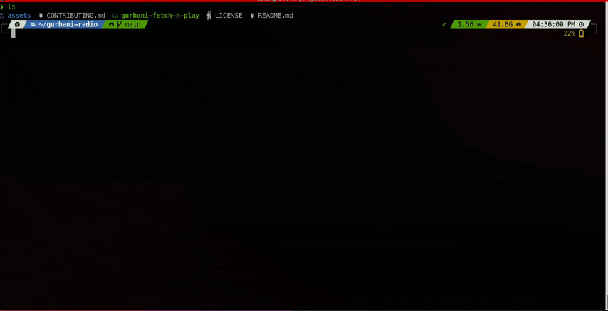

# 🎵 Gurbani Live - Bringing divine music to your terminal ✨

)


**🎶 Gurbani Live** is a bash script that fetches live Gurbani channels from Sikhnet.com and allows you to play them using VLC. It also provides options to check the online status of channels and stop any ongoing playback.

This project combines the gists I have written together with `fzf`
- [get-live-gurbani-channels.sh](https://gist.github.com/savitojs/ca6fd566d7bd890ce8568311c284a79d)
- [GoldenTempleLive.sh](https://gist.github.com/savitojs/699d2840d3d5115893c05246074f43b5)

### ⭐️ Like this project?

If you find this project helpful, please consider giving it a ⭐️ on [GitHub](https://github.com/savitojs/Gurbani-Live)! It helps others discover the project and motivates me to keep improving it. Thank you!

## ✨ Features

- Fetch and display live Gurbani channels from Sikhnet.com
- Play selected channels using VLC
- Check the online status of available channels
- Stop VLC playback directly from the command line
- Switch channels between online via CLI
- **Favorites System**: Mark channels as favorites for quick access
- **Quick Play**: Instantly resume your last played channel
- **Interactive Controls**: Stop, background, switch, favorite, and refresh options while playing

## Prerequisites

The script requires the following tools to be installed:

- `vlc` - VLC Media Player for audio playback
- `fzf` - Fuzzy finder for interactive selection
- `jq` - JSON processor for parsing API responses

### Installing Dependencies

**macOS (with Homebrew):**
```bash
brew install vlc fzf jq
```

**Ubuntu/Debian:**
```bash
sudo apt-get update && sudo apt-get install -y vlc fzf jq
```

**Fedora:**
```bash
sudo dnf install -y vlc fzf jq
```

The script will automatically check for these dependencies and attempt to install them if they are missing.

## Supported Platforms

- **macOS** (via Homebrew)
- **Fedora** (via `dnf`)
- **Ubuntu** (via `apt-get`)

## Usage

```bash
gurbani-live [options]
```


### Options

- `-h, --help`
  Show the help message and exit

- `-s, --stop`
  Stop the current VLC playback

- `-t, --status`
  Show the online status of available channels without playing them

- `-i, --install`
  Installs the script to writeable `$PATH` available

- `-u, --update`
  Update the insalled script if version mismatch

- `-v, --version`
  Shows the version of the installed script

- `-q, --quick`
  Quick play the last played channel

### Commands

- `completion [bash|zsh]`
  Generate shell completion function

## Shell Completion

The script includes built-in shell completion for bash and zsh that provides tab completion for all available options.

### Enable Completion

**One-time use:**
```bash
# For bash
source <(gurbani-live completion bash)

# For zsh
source <(gurbani-live completion zsh)
```

**Permanent setup:**
Add to your shell config file:
```bash
# For bash - add to ~/.bashrc
echo 'source <(gurbani-live completion bash)' >> ~/.bashrc

# For zsh - add to ~/.zshrc
echo 'source <(gurbani-live completion zsh)' >> ~/.zshrc
```

After enabling completion, you can use `<TAB>` to complete options:
```bash
gurbani-live --<TAB>
# Shows: --help --install --quick --status --stop --update --version
```

## Quick Installation

**One-line install (Latest stable release):**
```bash
curl -sL https://github.com/savitojs/Gurbani-Live/releases/latest/download/gurbani-live | bash -s -- --install
```

**Or install development version:**
```bash
curl -sL https://raw.githubusercontent.com/savitojs/Gurbani-Live/main/gurbani-live | bash -s -- --install
```

This will:
- ✅ Download and install the latest version
- ✅ **Interactive mode**: Let you choose installation directory
- ✅ **Non-interactive mode**: Auto-install to `~/.local/bin` or `~/bin` (when piped from curl)
- ✅ Clean up old script names automatically

**Note**: When using the one-liner method, the script automatically detects it's running non-interactively and will install to a default location (preferring `~/.local/bin`, then `~/bin`, then the first writable directory in your PATH).

## Alternative Installation

If you prefer to download first and then install:

```bash
curl -O https://raw.githubusercontent.com/savitojs/gurbani-live/main/gurbani-live
chmod +x gurbani-live
./gurbani-live --install
```

## Examples (once installed)

- **Fetch and Play**
  To fetch and play a channel:

  ```bash
  gurbani-live
  ```

- **Stop Playback**
  To stop the current playback:

  ```bash
  gurbani-live --stop
  ```

- **Show Status**
  To show the online status of channels:

  ```bash
  gurbani-live --status
  ```

- **Quick Play**
  To instantly play your last listened channel:

  ```bash
  gurbani-live --quick
  ```

## Interactive Features

When playing a channel, you have access to these interactive controls:

- **🛑 Stop (s)** - Stop the current playback
- **💤 Background (b)** - Continue playing in background
- **🔄 Switch (c)** - Switch to another channel
- **⭐ Favorite (f)** - Add/remove current channel from favorites
- **📻 Refresh (r)** - Refresh the channel list

### Favorites

The script includes a built-in favorites system:

- **Mark Favorites**: Press `f` while playing any channel to add/remove it from favorites
- **Visual Indication**: Favorite channels are marked with ⭐ in the channel list
- **Persistent Storage**: Your favorites are remembered between sessions

### Data Storage

The script creates and maintains these files in your home directory:

- **`~/.gurbani_favorites`** - Stores your favorite channels (one per line)
- **`~/.gurbani_last_played`** - Remembers your last played channel for quick access

These files are automatically created when needed and can be safely deleted to reset preferences.

## Migration from Old Version

If you have the old script named `gurbani-fetch-n-play`, the update process will automatically:

- ✅ Migrate to the new name `gurbani-live`
- ✅ Remove the old script file
- ✅ Preserve all functionality

Simply run:
```bash
gurbani-fetch-n-play --update
```

The script will guide you through the migration process.

## Development

### Documentation

- **[Testing Guide](docs/TESTING.md)** - Comprehensive guide for testing GitHub Actions locally with act and Podman
- **[Contributing Guidelines](CONTRIBUTING.md)** - How to contribute to the project

### Project Structure

```
├── docs/               # Documentation
│   └── TESTING.md     # Testing guide
├── test/              # Test scripts
│   ├── test-with-act.sh      # GitHub Actions local testing with act
├── .github/           # GitHub workflows
│   └── workflows/
│       └── release.yml       # Release automation
├── gurbani-live       # Main script
└── gurbani-live-completion.sh  # Shell completion
```

## License

This project is licensed under the MIT License.

## Credits

Gratitude to [Sikhnet](https://sikhnet.com) for their Gurbani Radio Service
