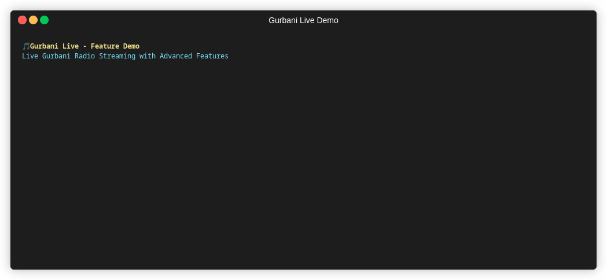

<p align="center">
  
</p>

<p align="center">
  <a href="https://github.com/savitojs/gurbani-live/actions/workflows/release.yml"></a>
  <a href="https://github.com/savitojs/gurbani-live/releases/latest"></a>
  <a href="https://github.com/savitojs/gurbani-live/blob/main/LICENSE"></a>  
  <a href="https://github.com/savitojs/gurbani-live/stargazers"></a>
</p>

<p align="center">
  Stream live Gurbani radio channels from <a href="https://sikhnet.com">Sikhnet.com</a> in your terminal via VLC.<br>
  <sub>If this is useful to you, a <a href="https://github.com/savitojs/gurbani-live">star</a> helps others find it.</sub>
</p>



## Features

- Browse and play live Gurbani channels with an interactive fzf picker
- Favorites, quick play (resume last channel), channel switching
- Single-keypress controls while playing: stop, background, switch, favorite, refresh
- Self-install and self-update
- Shell completion for bash and zsh

## Install

**One-liner (latest release):**
```bash
curl -sL https://github.com/savitojs/Gurbani-Live/releases/latest/download/gurbani-live | bash -s -- --install
```

**Or download first:**
```bash
curl -O https://raw.githubusercontent.com/savitojs/gurbani-live/main/gurbani-live
chmod +x gurbani-live
./gurbani-live --install
```

The installer picks `~/.local/bin` or `~/bin`, or lets you choose interactively.

## Dependencies

`vlc`, `fzf`, `jq`. The script checks for these on startup and offers to install them.

```bash
# macOS
brew install vlc fzf jq

# Ubuntu/Debian
sudo apt-get install -y vlc fzf jq

# Fedora
sudo dnf install -y vlc fzf jq
```

Flags like `--version`, `--help`, and `--stop` skip dependency checks.

## Usage

```bash
gurbani-live [options]
```

| Flag | What it does |
|------|-------------|
| `-h, --help` | Show help |
| `-s, --stop` | Stop playback |
| `-t, --status` | Show channel online status |
| `-i, --install` | Install to a writable `$PATH` directory |
| `-u, --update` | Update to latest version |
| `-v, --version` | Print version |
| `-q, --quick` | Resume last played channel |
| `completion [bash\|zsh]` | Generate shell completion |

### Controls

While playing, single-keypress controls (no Enter needed):

| Key | Action |
|-----|--------|
| `s` | Stop and exit |
| `b` | Background and detach |
| `c` | Switch channel |
| `f` | Toggle favorite |
| `r` | Refresh channel list |

### Shell Completion

```bash
# One-time
source <(gurbani-live completion bash)   # or zsh

# Permanent (add to ~/.bashrc or ~/.zshrc)
echo 'source <(gurbani-live completion bash)' >> ~/.bashrc
```

## Data Files

| File | Purpose |
|------|---------|
| `~/.gurbani_favorites` | Saved favorites (one per line) |
| `~/.gurbani_last_played` | Last played channel for `--quick` |
| `~/.gurbani_vlc_pid` | PID of the VLC instance started by this script |

Temp files go to `/tmp/gurbani-live.<pid>.*` and are cleaned up on exit via trap.

All files can be safely deleted to reset preferences.

## Migration

If you have the old `gurbani-fetch-n-play` script, run:

```bash
gurbani-fetch-n-play --update
```

It migrates to the new name and removes the old file.

## Development

- [Testing Guide](docs/TESTING.md) - Testing CI/CD workflows locally with act and Podman
- [Contributing](CONTRIBUTING.md) - How to contribute

```
.
├── gurbani-live                    # Main script
├── gurbani-live-completion.sh      # Shell completion (standalone)
├── docs/TESTING.md                 # CI/CD testing guide
├── test/test-with-act.sh           # Local test runner for act
├── .github/workflows/release.yml   # Release automation
└── assets/demo.gif                 # Terminal demo
```

## License

MIT

## Credits

Thanks to [Sikhnet](https://sikhnet.com) for their Gurbani Radio Service.
